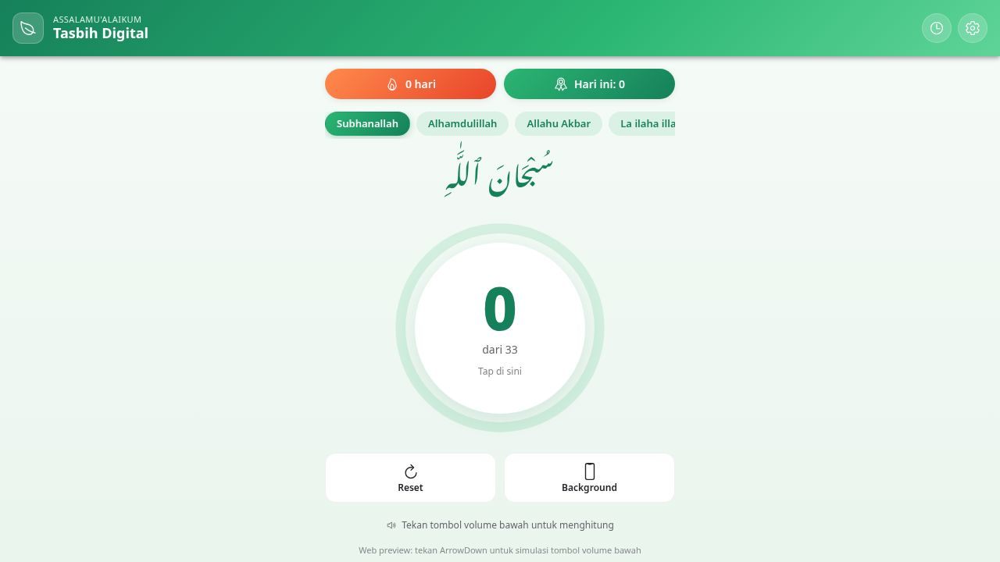
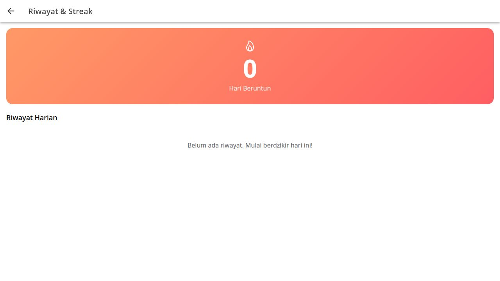

# Tasbih Digital

Aplikasi tasbih digital modern berbasis Ionic Vue 3 + Capacitor. Mendukung beragam jenis dzikir, hitungan via tap layar atau tombol volume bawah, mode background saat layar terkunci, riwayat harian, dan streak.

## Tampilan

### Halaman Utama


### Riwayat & Streak


## Fitur

- **Beragam jenis dzikir** — Subhanallah, Alhamdulillah, Allahu Akbar, La ilaha illallah, Astaghfirullah, Shalawat Nabi, dan mode bebas. Setiap jenis punya counter dan target sendiri.
- **Area tap besar** — Lingkaran progress di tengah layar adalah tombol hitung. Cincin hijau mengisi sesuai persentase target.
- **Tombol volume bawah** — Hitung tanpa melihat layar (Android/iOS via Capacitor plugin).
- **Mode Layar Mati (background)** — Foreground service Android + Web Audio silent loop + KeepAwake supaya tombol volume tetap aktif saat HP terkunci.
- **Riwayat harian otomatis** — Setiap hari dicatat per jenis dzikir.
- **Streak** — Jumlah hari berturut-turut dengan minimal satu dzikir.
- **Penyimpanan lokal** — Semua data tersimpan di perangkat (localStorage).
- **Haptic feedback** — Getar saat target tercapai (mobile + Vibration API di web).
- **Dark mode otomatis** mengikuti pengaturan sistem.
- **Header modern** dengan gradien hijau emerald dan sapaan Assalamu'alaikum.

## Tech Stack

- **Framework**: Ionic Framework 8
- **UI**: Vue 3 (Composition API + Options API mix)
- **Build Tool**: Vite 6
- **Mobile Runtime**: Capacitor 6
- **Bahasa**: TypeScript
- **Plugins Capacitor**:
  - `@capacitor/haptics` — getaran
  - `@capacitor/app` — lifecycle event
  - `@capacitor-community/volume-buttons` — tombol volume
  - `@capacitor-community/keep-awake` — cegah CPU tidur
  - `@capawesome-team/capacitor-android-foreground-service` — service background

## Prasyarat

- Node.js LTS
- npm
- Untuk build Android: Android Studio + JDK 17+

## Pengembangan

```bash
npm install
npm run dev
```

Server dev jalan di `http://localhost:5000`. Di preview web, tombol **ArrowDown** keyboard akan mensimulasikan tombol volume bawah.

## Build untuk Android

```bash
npm run build
npx cap sync android
npx cap open android   # buka di Android Studio, lalu Run
```

> **Penting (HP merek tertentu)**: Di Xiaomi/Oppo/Vivo/Huawei, masuk **Settings → Apps → Tasbih → Battery → No restrictions** dan matikan Battery Optimization agar foreground service tidak dimatikan paksa oleh sistem.

## Build untuk iOS (macOS saja)

```bash
npm run build
npx cap sync ios
npx cap open ios
```

## Struktur Proyek

```
src/
├── App.vue
├── main.ts
├── router/
│   └── index.ts            # Definisi rute Home & History
├── views/
│   ├── HomePage.vue        # Halaman utama: counter, chip dzikir, dll
│   └── HistoryPage.vue     # Halaman riwayat & streak
├── composables/
│   └── useTasbihStore.ts   # State management + persistensi localStorage
└── theme/
    └── variables.css
android/                    # Project Android (Capacitor)
public/                     # Aset statis
screenshots/                # Tangkapan layar untuk README
```

## Scripts

| Perintah              | Fungsi                                  |
|-----------------------|-----------------------------------------|
| `npm run dev`         | Start dev server (port 5000)            |
| `npm run build`       | Build production ke `dist/`             |
| `npm run preview`     | Preview hasil build                     |
| `npm run lint`        | Lint dengan ESLint                      |
| `npm run test:unit`   | Unit test (Vitest)                      |
| `npm run test:e2e`    | E2E test (Cypress)                      |

## Lisensi

Pribadi / belum ditentukan.
